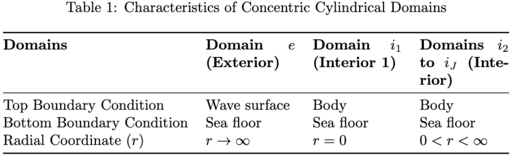

.. currentmodule:: package.domain

Domain Module
=============

   **Figure 1**: This table illustrates the domain characteristics.

.. figure:: _static/domain_drawing.png
   :alt: Example of how domains would look
   :align: center
   :width: 100%

   **Figure 2**: This image illustrates the domain characteristics.

This module defines the `Domain` class, which represents the characteristics of a physical domain.

.. automodule:: domain
   :members:
   :undoc-members:

Class:
--------

.. autoclass:: domain.Domain
   :members:
   :noindex:
   :undoc-members:
   :show-inheritance:

Attributes:
-----------
- `number_harmonics`: int — Number of harmonics in the domain.
- `height`: float — Height of the domain.
- `radial_width`: float — Radial width of the domain.
- `top_BC`: float — Top boundary condition.
- `bottom_BC`: float — Bottom boundary condition.
- `category`: str — Category of the domain, indicating if it is 'inner', 'outer', or 'exterior'.
- `params`: dict — Dictionary of parameters specific to the domain, such as `h`, `di`, `a1`, `a2`, `m0`.
- `index` : int - Index of the domain in the multi-region setup.

Methods:
--------

.. method:: __init__(number_harmonics, height, radial_width, top_BC, bottom_BC, category, params)
   :noindex:

   Initializes the Domain class with specified parameters.

   :param number_harmonics: The number of harmonics.
   :type number_harmonics: int
   :param height: Height of the domain.
   :type height: float
   :param radial_width: Radial width of the domain.
   :type radial_width: float
   :param top_BC: Top boundary condition.
   :type top_BC: float
   :param bottom_BC: Bottom boundary condition.
   :type bottom_BC: float
   :param category: Type of the domain (e.g., 'inner', 'outer', 'exterior').
   :type category: str
   :param params: Dictionary containing parameters like `h`, `di`, `a1`, `a2`, `m0`.
   :type params: dict