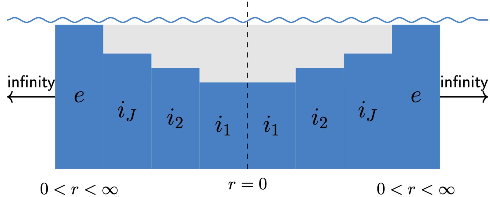

.. _domain-module:

==============
Domain Module
==============

.. automodule:: openflash.domain

.. _domain-overview:

Conceptual Overview
===================

The ``Domain`` class represents a single, annular (ring-shaped) region of fluid within the simulation. In the Matched Eigenfunction Expansion Method (MEEM), the entire fluid volume is subdivided into these simple domains, each characterized by a constant depth and defined by inner and outer radial boundaries.

   **Figure 1**: A typical problem geometry is divided into multiple concentric fluid domains, including interior domains under the bodies and a final, semi-infinite exterior domain.

**Role in the Workflow**

It's important to understand that end-users of the OpenFLASH package **do not typically create ``Domain`` objects directly**. Instead, ``Domain`` objects are the output generated by a :ref:`geometry-module` class (like ``BasicRegionGeometry``).

The typical workflow is:
1. The user defines the physical structures as a collection of :ref:`body-module` objects.
2. These bodies are passed to a ``Geometry`` object.
3. The ``Geometry`` object processes the physical layout and automatically generates the corresponding list of fluid ``Domain`` objects, each with the correct boundaries and properties.

Each ``Domain`` then holds the necessary information for the ``MEEMEngine`` to construct the mathematical solution within that specific region.

.. figure:: ../_static/domain_table.png
   :alt: Table of domains
   :align: center
   :width: 100%

   **Table 2**: This table summarizes the key attributes that define each type of fluid domain.

.. _domain-api:

API Reference
=============

.. autoclass:: openflash.domain.Domain
   :members:
   :undoc-members:
   :show-inheritance: