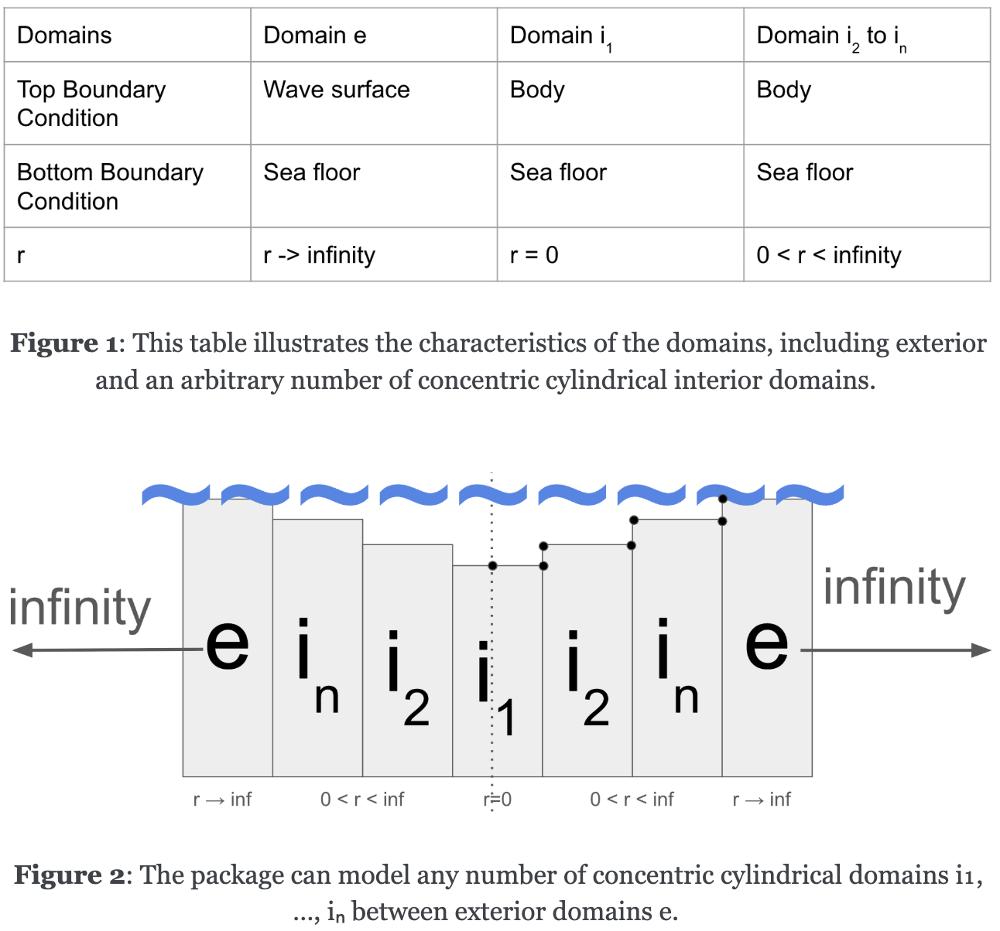
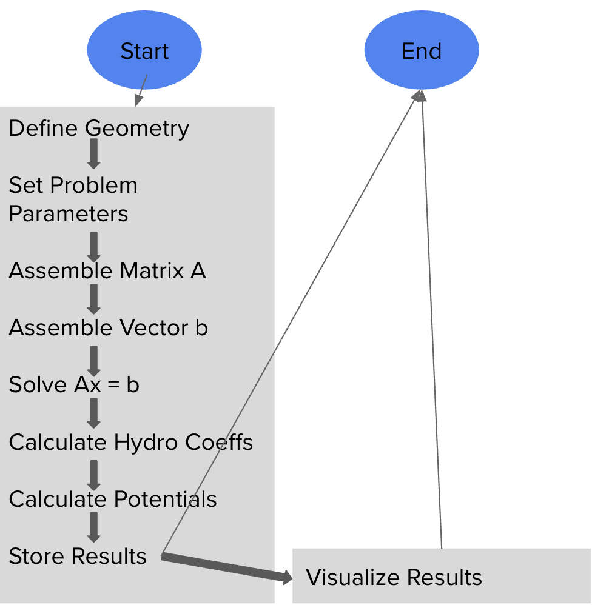

# Summary

`open_flash` is a Python package designed for solving boundary value problems using matched eigenfunction expansion methods, particularly in scenarios involving multiple connected cylindrical regions, with a specific focus on modeling wave energy converter (WEC) arrays.. It provides a modular framework for defining complex geometries, setting up multi-domain problems with appropriate boundary and matching conditions, performing numerical computations to determine the hydro coefficients, and subsequently analyzing the resulting potential and velocity potentials. The package includes tools for data storage using `xarray`, a comprehensive testing suite using `unittest`, an interactive simulation application built with Streamlit (`docs/app.py`) for real-time parameter adjustment and visualization, and extensive documentation built with Sphinx. `open_flash` implements a sequential workflow from geometry definition to result visualization. `open_flash` is well-suited for applications in fluid dynamics and other areas where boundary value problems in cylindrical coordinates arise.


# Statement of Need

Semi-analytical methods, such as the matched eigenfunction expansion method, offer an efficient and often accurate alternative to purely numerical techniques like Finite Element Methods (FEM) or Boundary Element Methods (BEM) for certain classes of boundary value problems. These methods are particularly advantageous when dealing with geometries that can be decomposed into simpler sub-regions where analytical solutions (in the form of eigenfunction expansions) are known or can be derived. By matching these solutions at the interfaces between sub-regions, a system of linear equations can be formed and solved for the unknown expansion coefficients.

**Wave energy converters (WEC) hold significant promise for transforming the oscillatory motion of waves into usable energy, offering high predictability and enhanced energy security that complements other renewable sources like wind and solar power. However, the optimization of WECs, particularly in array configurations, has been hindered by the substantial computational costs associated with modeling their hydrodynamic interactions in waves. This project aims to address this challenge by developing `open_flash`, an open-source and computationally efficient software tool for modeling WEC arrays using semi-analytical methods.**

`open_flash` aims to provide a robust and user-friendly Python implementation of this methodology, specifically tailored for problems involving connected cylindrical domains. The package is designed to handle multi-domain problems, including exterior domains extending to infinity and interior domains with specific radial extents, each with defined top and bottom boundary conditions. The computational workflow begins with defining the geometry and problem parameters, followed by assembling and solving the linear system, calculating hydrodynamic coefficients and potentials, storing the results, and finally visualizing them. This specialization can lead to more efficient problem setup and solution, particularly in fields like marine hydrodynamics and the burgeoning field of wave energy technology. The package addresses the need for a tool that bridges the gap between analytical derivations and numerical computation for this important class of problems, and further provides tools for managing, testing, interactively visualizing, documenting, and outlining its computational process.

# Functionality

`open_flash` offers the following key functionalities:

* **Modular Geometry Definition:** The `Geometry` class represents the physical setup of the problem, managing radial (`r_coordinates`) and vertical (`z_coordinates`) dimensions and parameters for individual sub-regions (domains). It is responsible for creating a list of `Domain` objects based on the provided input.
* **Domain Representation:** The `Domain` class represents a sub-region within the defined geometry. Each domain possesses properties such as height, radial width, and specific boundary conditions at its top and bottom. The class also calculates the spatial coordinates relevant to the domain.



* **Problem Setup:** The `MEEMProblem` class sets up the computational problem by defining the relevant frequencies and modes of analysis. It links the `Geometry` object to the problem definition and maintains a list of the `Domain` objects necessary for the subsequent computations.
* **MEEM Computation Engine:** The `MEEMEngine` class is the core of the package, responsible for managing the matched eigenfunction expansion method. It assembles the system matrix ($A$) and the right-hand side vector ($b$) based on the geometry, boundary conditions, and matching conditions. It then solves the resulting linear system ($Ax = b$) to determine the unknown coefficients of the eigenfunction expansions. Additionally, it calculates hydrodynamic coefficients and the potential fields within each domain.



* **Results Management:** The `Results` class provides a structured way to store and organize the output of the MEEM computations using the `xarray` library, adhering to conventions similar to those used in the `Capytaine` library. It offers methods for storing various results, including velocity potentials and hydrodynamic coefficients, and facilitates accessing and exporting these results to NetCDF (`.nc`) files.
* **Visualization:** The package includes visualization capabilities, as demonstrated in the Streamlit application.
* **Documentation:** The package utilizes `Sphinx` to generate comprehensive documentation. The documentation includes a tutorial that guides users through the process of using the package and explains its capabilities. The documentation is built into HTML format for easy accessibility.
* **Interactive Simulation and Visualization:** A Streamlit application (`docs/app.py`) provides a graphical user interface for interacting with `open_flash`. Users can define problem parameters through the GUI, run simulations, and visualize the resulting potential and velocity fields in real-time. This interactive tool enhances the usability and accessibility of the package.
* **Testing Suite:** The package includes a comprehensive suite of unit tests (`tests` directory) using the `unittest` framework. These tests cover the core functionalities, ensuring the reliability and correctness of the code across different modules.

# Examples

The `tests` directory contains several unit tests demonstrating the usage of different modules within `open_flash`. The `docs` directory contains the `app.py` script, which provides a fully functional interactive application built with Streamlit. This application allows users to define multi-domain problems by inputting parameters such as water height, body dimensions, heaving states, and slant vectors for each region. Users can also control the number of harmonics and spatial resolution. The app then computes the hydrodynamic coefficients and generates plots of the real and imaginary parts of the total, homogeneous, and particular potentials, as well as the radial and vertical velocity potentials. The `docs` directory also contains the Sphinx documentation, including a tutorial on how to use the package.

# Impact

`open_flash` provides a specialized and powerful tool for researchers and engineers working on boundary value problems in domains with connected cylindrical geometries, with a particular emphasis on advancing the field of wave energy conversion. Its modular design and focus on the matched eigenfunction expansion method offer several key benefits for WEC research:

* **Computational Efficiency for WEC Arrays:** By offering a computationally efficient semi-analytical approach, `open_flash` will enable faster comparative analyses of different WEC array configurations, which are crucial for optimizing energy extraction and reducing costs. This addresses a significant bottleneck in the WEC development process.
* **Accessibility for WEC Researchers:** The translation of hydrodynamic models into a user-friendly Python package, coupled with comprehensive documentation, clear tutorials, and optimized code, will make complex WEC simulations accessible to a wider range of researchers, lowering the barrier to entry in this important field.
* **Acceleration of WEC Technology Development:** By providing accessible and efficient modeling tools, `open_flash` aims to accelerate the development and deployment of wave energy technology. This will contribute to the growth of the Blue Economy and the advancement of renewable energy solutions, enhancing energy security and reducing reliance on fossil fuels.
* **Design Optimization and Innovation:** The practical application of this work will allow researchers and developers to efficiently optimize WEC array designs, leading to more innovative and effective wave energy technologies. The ability to rapidly explore different geometries and configurations will foster advancements in WEC design.
* **Open-Source and Community-Driven:** As an open-source project, `open_flash` encourages community contributions, further enhancing its capabilities and ensuring its long-term sustainability and utility for the wave energy research community. The focus on clear documentation and user-friendly implementation promotes collaboration and wider adoption.

The initial development of hydrodynamic models by Bimali and En lays the groundwork for this package, and the ongoing work to refine the code structure, optimize usability, incorporate diverse WEC geometries, and expand documentation will ensure that `open_flash` becomes a valuable asset for the wave energy research community.

# Acknowledgements

We acknowledge the foundational work on matched eigenfunction methods as presented in the cited references. The development of `open_flash` has been supported by the resources and expertise within the SEA LAB, led by Professor Maha N. Haji. We also acknowledge the contributions of the following students to the development of this software: Bimali, En, Ruiyang, Becca, Collin, and Kapil. We also acknowledge the ongoing collaborations with Jessica, Clint, and Brittany for their work on validating and extending the capabilities of `open_flash` to elliptical and Cartesian coordinate systems.

# References

```bibtex
@book{Chatjigeorgiou2018,
  author = {I. K. Chatjigeorgiou},
  title = {Analytical Methods in Marine Hydrodynamics},
  publisher = {Cambridge University Press},
  year = {2018},
  doi = {10.1017/9781316838983},
}
@misc{Chau2010,
  author = {F. P. Chau and R. W. Yeung},
  title = {Inertia and Damping of Heaving Compound Cylinders},
  howpublished = {Presented at the 25th International Workshop on Water Waves and Floating Bodies, Harbin, China},
  year = {2010},
  url = {[https://www.academia.edu/73219479/Inertia_and_Damping_of_Heaving_Compound_Cylinders_Fun](https://www.academia.edu/73219479/Inertia_and_Damping_of_Heaving_Compound_Cylinders_Fun)},
  note = {Accessed: Sep. 27, 2023}
}
@inproceedings{Chau2013,
  author = {F. P. Chau and R. W. Yeung},
  title = {Inertia, Damping, and Wave Excitation of Heaving Coaxial Cylinders},
  booktitle = {ASME 2012 31st International Conference on Ocean, Offshore and Arctic Engineering},
  pages = {803--813},
  year = {2013},
  doi = {10.1115/OMAE2012-83987},
  publisher = {American Society of Mechanical Engineers Digital Collection}
}
@article{Yeung1981,
  author = {R. W. Yeung},
  title = {Added mass and damping of a vertical cylinder in finite-depth waters},
  journal = {Appl. Ocean Res.},
  volume = {3},
  number = {3},
  pages = {119--133},
  year = {1981},
  doi = {10.1016/0141-1187(81)90101-2}
}
@article{Son2016,
  author = {D. Son and V. Belissen and R. W. Yeung},
  title = {Performance validation and optimization of a dual coaxial-cylinder ocean-wave energy extractor},
  journal = {Renew. Energy},
  volume = {92},
  pages = {192--201},
  year = {2016},
  doi = {10.1016/j.renene.2016.01.032}
}
@article{Kokkinowrachos1986,
  author = {K. Kokkinowrachos and S. Mavrakos and S. Asorakos},
  title = {Behaviour of vertical bodies of revolution in waves},
  journal = {Ocean Eng.},
  volume = {13},
  number = {6},
  pages = {505--538},
  year = {1986},
  doi = {10.1016/0029-8018(86)90037-5}
}