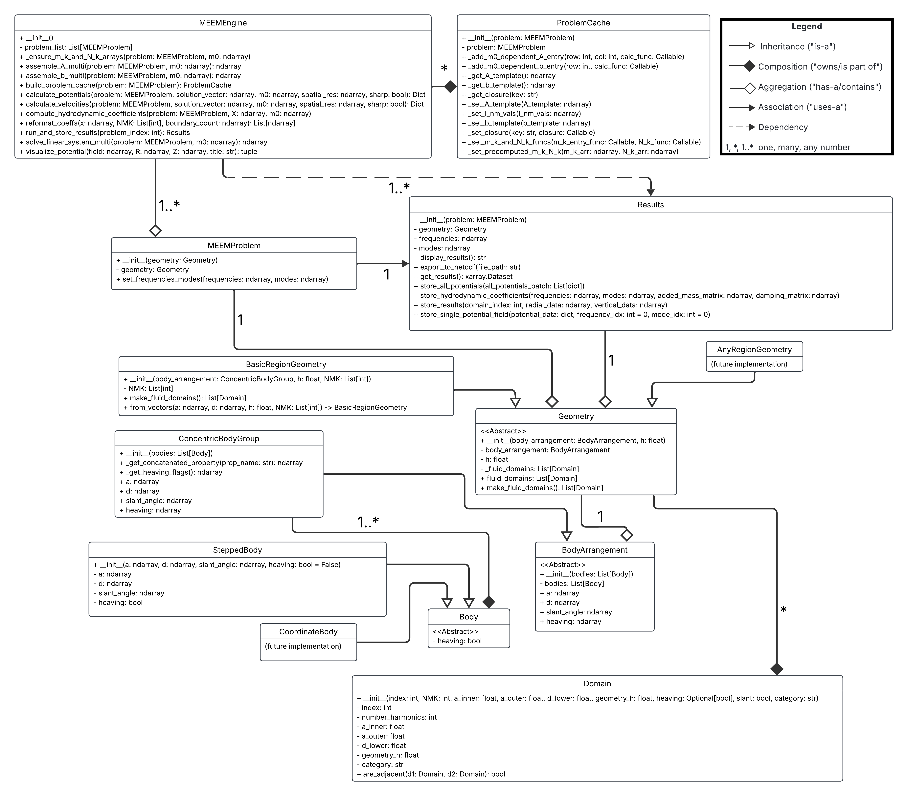
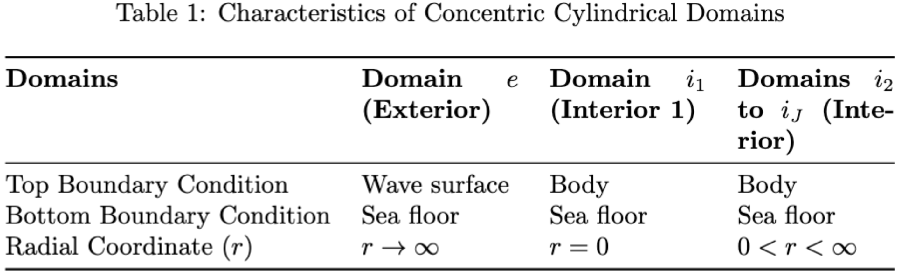
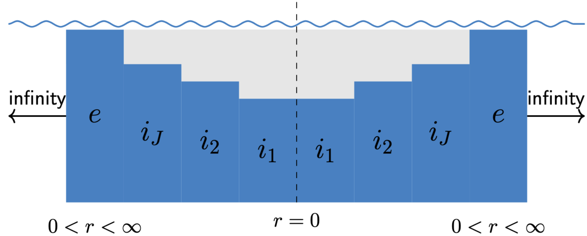
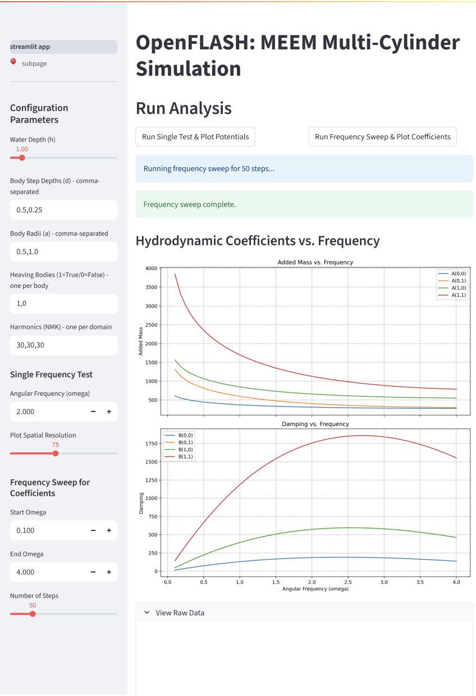
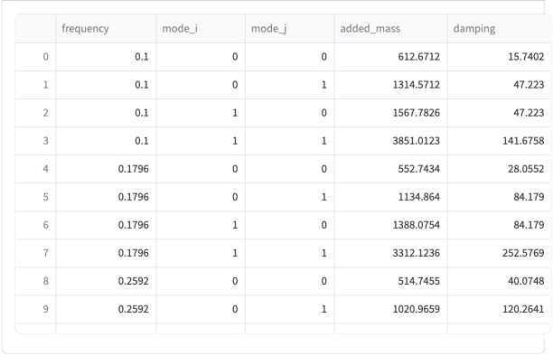
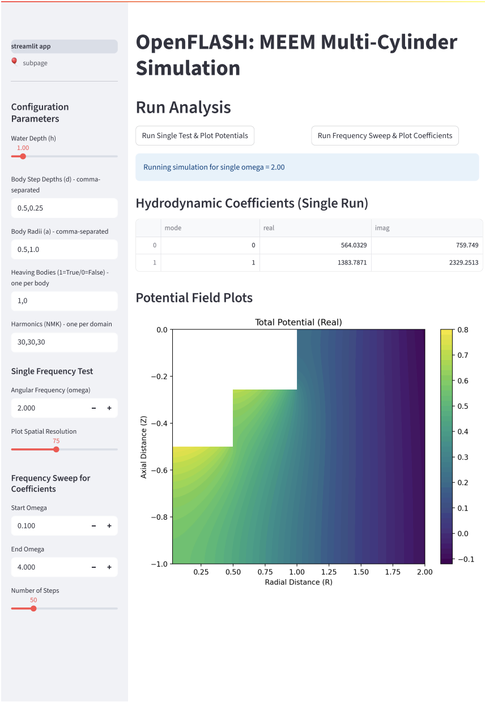
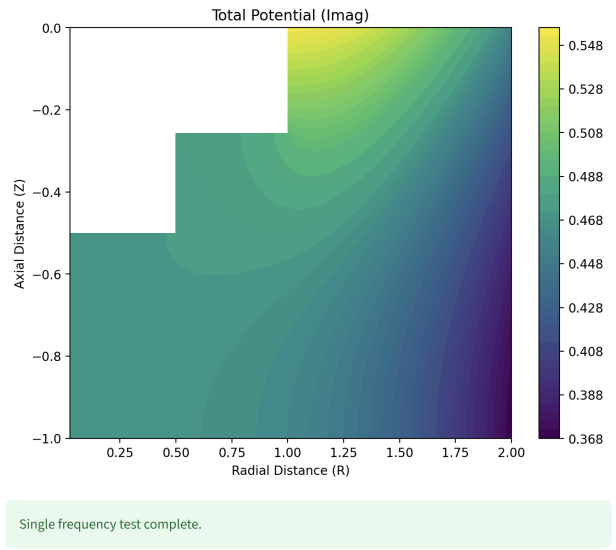

# Summary

OpenFLASH is a Python package for solving hydrodynamic boundary value problems using analytical and semi-analytical methods. It currently implements the matched eigenfunction expansion method for bodies of multiple concentric cylinders. This method, presented by [@mccabe2024open] at the UMERC+METS 2024 Conference, can reduce the runtime by an order of magnitude compared to traditional Boundary Element Method (BEM) solvers, making it more suitable for design optimization studies of floating structures such as wave energy converters (WECs).

# Statement of Need

Wave energy converters (WEC) hold significant promise for transforming the oscillatory motion of waves into usable energy, offering high predictability and enhanced energy security that complements other renewable sources like wind and solar power [@bhattacharya2021timing; @fusco2010variability]. However, the optimization of WECs has been hindered by the substantial computational costs of modeling their hydrodynamic interactions in waves. This project aims to address this challenge by developing OpenFLASH, an open-source and computationally efficient software tool for modeling hydrodynamic forces using semi-analytical methods.

OpenFLASH aims to provide a robust and user-friendly Python implementation of this methodology, specifically tailored for problems involving connected cylindrical domains. The package is designed to handle multi-domain problems, including exterior domains extending to infinity and interior domains with specific radial extents, each with defined top and bottom boundary conditions. The computational workflow begins with defining the geometry and problem parameters, followed by assembling and solving the linear system, calculating hydrodynamic coefficients and potentials, storing the results, and finally visualizing them. This specialization can lead to more efficient problem setup and solution, particularly useful in fields like marine hydrodynamics and the burgeoning field of wave energy technology. The package addresses the need for a tool that bridges the gap between analytical derivations and numerical computation for this important class of problems. Furthermore, it provides tools for managing, testing, interactively visualizing, documenting, and outlining its computational process.

# Functionality

OpenFLASH provides a complete, end-to-end workflow for hydrodynamic analysis, centered around an intuitive, object-oriented API. \autoref{fig:uml} demonstrates the relationships between classes in the package.

* Intuitive Geometry Definition: Users define the physical problem by creating SteppedBody objects, which represent single- or multi-step cylindrical structures. These objects are then grouped into a ConcentricBodyGroup and passed to a BasicRegionGeometry class, which automatically partitions the fluid volume into the discrete Domain objects required by the solver (see \autoref{fig:domain_table}).

\autoref{fig:domain_drawing} shows a typical problem geometry is divided into multiple concentric fluid domains, including interior domains under the bodies and a final, semi-infinite exterior domain.

* Problem Setup: The MEEMProblem class sets up the computational problem by defining the relevant frequencies and degrees of freedom of analysis.
* MEEM Computation Engine: The MEEMEngine class is the core of the package, responsible for implementing the matched eigenfunction expansion method. 
* Problem Cache for Efficient Computation: The ProblemCache class is designed to enhance the computational efficiency of the MEEMEngine class significantly.
* Results Management: The Results class provides a structured way to store and organize the output of the MEEM computations using the xarray library, adhering to conventions similar to those used in the Capytaine library to facilitate drop-in replacement for Capytaine users.
* Documentation: The package utilizes Sphinx to generate comprehensive documentation. The documentation includes a tutorial that guides users through the process of using the package and explains its capabilities. The sphinx documentation is deployed in the browser through: [https://symbiotic-engineering.github.io/OpenFLASH/](https://symbiotic-engineering.github.io/OpenFLASH/).
* Interactive Simulation and Visualization: A Streamlit application (docs/app.py) provides a graphical user interface for interacting with OpenFLASH. Users can define problem parameters through the GUI, run simulations, and visualize the resulting potential fields in real-time. This interactive tool enhances the usability and accessibility of the package. The streamlit app is deployed through: [https://symbiotic-engineering.github.io/OpenFLASH/app\_streamlit.html](https://symbiotic-engineering.github.io/OpenFLASH/app_streamlit.html).

* Testing Suite: The package includes a comprehensive suite of unit tests (tests directory) using the pytest framework to ensure the code's reliability and correctness. These tests cover the core functionalities, ensuring the reliability and correctness of the code across different modules.

# Impact

OpenFLASH provides a specialized and powerful tool for researchers and engineers working on boundary value problems in domains with connected cylindrical geometries, with a particular emphasis on advancing the field of wave energy conversion. Its modular design and focus on the matched eigenfunction expansion method offer several key benefits for WEC research such as accessibility for WEC researchers, accelerating WEC innovation through efficient modeling, and being both open-source and community-driven. 

The initial development of hydrodynamic models lays the groundwork for this package, and the ongoing work to refine the code structure, optimize usability, incorporate diverse WEC geometries, and expand documentation will ensure that OpenFLASH becomes a valuable asset for the wave energy research community.

# Acknowledgements

We acknowledge the foundational work on matched eigenfunction methods as presented in the cited references. The development of OpenFLASH has been supported by the resources and expertise within the SEA Lab, led by Professor Maha N. Haji. We also acknowledge the contributions of the following students to the development of this software: Yinghui Bimali, En Lo, and John Fernandez. We also acknowledge the ongoing collaborations with Jessica Nguyen, Clint Chester Reyes, and Brittany Lydon for their work on validating and extending the capabilities of OpenFLASH to elliptical and Cartesian coordinate systems. We thank Prof. R. W. Yeung and Seung-Yoon Han for discussions on the theory and computation of this method.

We also gratefully acknowledge support for Kapil Khanal from a Sandia National Laboratories seedling grant and Rebecca McCabe from the NSF GRFP. The contributions of undergraduate researchers were supported by Cornell University’s Engineering Learning Initiative (ELI).

This material is based upon work supported by the National Science Foundation Graduate Research Fellowship under Grant No.DGE–2139899. Any opinion, findings, and conclusions or recommendations expressed in this material are those of the authors and do not necessarily reflect the views of the National Science Foundation.

# References