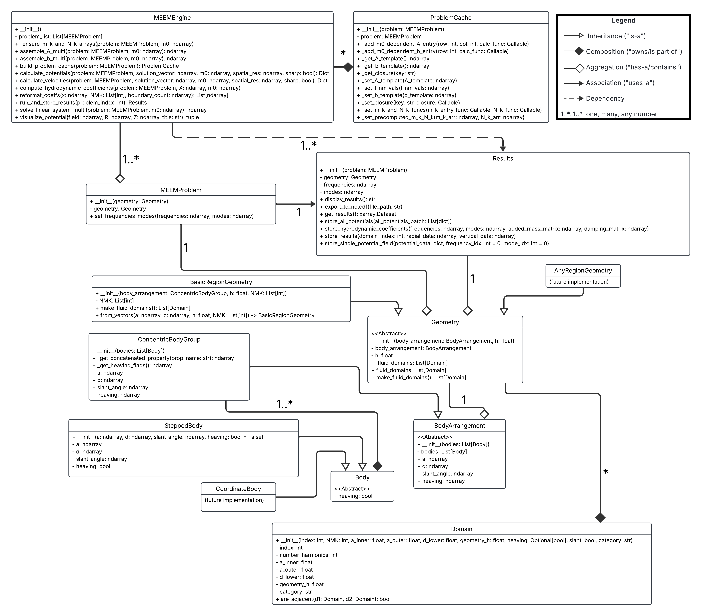

# **OpenFLASH: An open-source flexible library for analytical and semi-analytical hydrodynamics calculations**

Hope Best, Kapil Khanal, Rebecca McCabe, Ruiyang Jiang, Collin Treacy, Maha Haji

## **Summary**

OpenFLASH is a Python package for solving hydrodynamic boundary value problems using analytical and semi-analytical methods. It currently implements the matched eigenfunction expansion method for bodies of multiple concentric cylinders. This method, presented by McCabe et al. (2024) at the UMERC+METS 2024 Conference, can reduce the runtime by an order of magnitude compared to traditional Boundary Element Method (BEM) solvers, making it more suitable for design optimization studies of floating structures such as wave energy converters (WECs).

It provides a modular framework for:

* Defining complex cylindrical geometries
* Setting up multi-domain problems with appropriate boundary and matching conditions
* Performing numerical computations to determine the hydrodynamic coefficients
* Visualizing the resulting potential and velocity fields
* Caching intermediate values to speed up the evaluation of multiple problems

The package includes tools for:

* Data storage using xarray
* A comprehensive testing suite using pytest
* An interactive simulation application built with Streamlit (docs/app.py) for real-time parameter adjustment and visualization
* Extensive documentation built with Sphinx

OpenFLASH features a modern, object-oriented API that allows users to define complex physical geometries intuitively. The core workflow involves creating SteppedBody objects to represent physical structures, which are then automatically used to construct the problem geometry. The package provides a modular framework for setting up multi-domain problems, solving for hydrodynamic coefficients, and visualizing the resulting potential fields. Key features include an internal caching system for efficient frequency sweeps, a comprehensive testing suite using pytest, and an interactive Streamlit application for real-time visualization. All simulation outputs are managed in a structured xarray.Dataset, facilitating easy analysis and export.

## **Statement of Need**

Semi-analytical methods, such as the matched eigenfunction expansion method, offer an efficient and often accurate alternative to purely numerical techniques like Boundary Element Methods (BEM) for solving certain classes of hydrodynamic boundary value problems to calculate wave loads on offshore structures. These methods are particularly advantageous when dealing with geometries that can be decomposed into simpler sub-regions where analytical solutions (in eigenfunction expansions) are known or can be derived. By matching these solutions at the interfaces between sub-regions, a system of linear equations can be formed and solved for the unknown expansion coefficients.

Wave energy converters (WEC) hold significant promise for transforming the oscillatory motion of waves into usable energy, offering high predictability and enhanced energy security that complements other renewable sources like wind and solar power (Bhattacharya et al., 2021; Fusco et al., 2010). However, the optimization of WECs has been hindered by the substantial computational costs of modeling their hydrodynamic interactions in waves. This project aims to address this challenge by developing OpenFLASH, an open-source and computationally efficient software tool for modeling hydrodynamic forces using semi-analytical methods.

OpenFLASH aims to provide a robust and user-friendly Python implementation of this methodology, specifically tailored for problems involving connected cylindrical domains. The package is designed to handle multi-domain problems, including exterior domains extending to infinity and interior domains with specific radial extents, each with defined top and bottom boundary conditions. The computational workflow begins with defining the geometry and problem parameters, followed by assembling and solving the linear system, calculating hydrodynamic coefficients and potentials, storing the results, and finally visualizing them. This specialization can lead to more efficient problem setup and solution, particularly useful in fields like marine hydrodynamics and the burgeoning field of wave energy technology. The package addresses the need for a tool that bridges the gap between analytical derivations and numerical computation for this important class of problems. Furthermore, it provides tools for managing, testing, interactively visualizing, documenting, and outlining its computational process.

## **Functionality**

OpenFLASH provides a complete, end-to-end workflow for hydrodynamic analysis, centered around an intuitive, object-oriented API. The UML diagram above demonstrates the relationships between classes in the package.

* Intuitive Geometry Definition: Users define the physical problem by creating SteppedBody objects, which represent single- or multi-step cylindrical structures. These objects are then grouped into a ConcentricBodyGroup and passed to a BasicRegionGeometry class, which automatically partitions the fluid volume into the discrete Domain objects required by the solver. This abstracts away the complex task of manually defining fluid domains and matching conditions. The body and geometry definitions are general enough to accommodate future extensions such as curved bodies, arrays, and bodies with multiple vertical surfaces at a given radius, such as damping plates.

Table 1: This table summarizes the key attributes that define each type of fluid domain.

Figure 2: A typical problem geometry is divided into multiple concentric fluid domains, including interior domains under the bodies and a final, semi-infinite exterior domain.

* Problem Setup: The MEEMProblem class sets up the computational problem by defining the relevant frequencies and degrees of freedom of analysis. It links the Geometry object to the problem definition and maintains a list of the Domain objects necessary for subsequent computations.
* MEEM Computation Engine: The MEEMEngine class is the core of the package, responsible for implementing the matched eigenfunction expansion method. It assembles the system matrix (*A*) and the right-hand side vector (*b*) based on the geometry, boundary conditions, and matching conditions. It then solves the resulting linear system (*Ax=b*) to determine the unknown coefficients of the eigenfunction expansions. Using these eigencoefficients, it calculates hydrodynamic coefficients and the potential fields within each domain. The calculation leverages numerical techniques and vectorization strategies detailed in McCabe et al. (2025, in preparation).
* Problem Cache for Efficient Computation: The ProblemCache class is designed to enhance the computational efficiency of the MEEMEngine class significantly. Solving for the unknown expansion coefficients involves assembling and solving a system of linear equations, *Ax \= b*. Many terms within the system matrix *A* and the right-hand side vector *b* are independent of the wavenumber (*m0*). Recomputing these constant terms for every *m0* would be computationally expensive. The ProblemCache addresses this by pre-computing and storing the *A* matrix and *b* vector templates, specifically the parts that are independent of *m0*. It then identifies and stores the indices of the *m0*\-dependent terms, along with references to the functions required to calculate their values. This approach allows quick updates of only the necessary *m0*\-dependent entries for each new *m0* value, rather than reassembling the entire system. Furthermore, the ProblemCache stores precomputed arrays for precomputed arrays of wave numbers (*mk*) and normalization factors (*Nk*). By providing these pre-computed arrays and the functions to calculate the *m0*\-dependent terms, the ProblemCache reduces overall computation time.
* Results Management: The Results class provides a structured way to store and organize the output of the MEEM computations using the xarray library, adhering to conventions similar to those used in the Capytaine library to facilitate drop-in replacement for Capytaine users. It offers methods for storing various results, including velocity potentials and hydrodynamic coefficients, and facilitates accessing and exporting these results to NetCDF (.nc) files.
* Documentation: The package utilizes Sphinx to generate comprehensive documentation. The documentation includes a tutorial that guides users through the process of using the package and explains its capabilities. The documentation is built in HTML format for easy accessibility. The sphinx documentation is deployed in the browser through: [https://symbiotic-engineering.github.io/OpenFLASH/](https://symbiotic-engineering.github.io/OpenFLASH/).
* Interactive Simulation and Visualization: A Streamlit application (docs/app.py) provides a graphical user interface for interacting with OpenFLASH. Users can define problem parameters through the GUI, run simulations, and visualize the resulting potential fields in real-time. This interactive tool enhances the usability and accessibility of the package. The streamlit app is deployed through: [https://symbiotic-engineering.github.io/OpenFLASH/app\_streamlit.html](https://symbiotic-engineering.github.io/OpenFLASH/app_streamlit.html).

* Testing Suite: The package includes a comprehensive suite of unit tests (tests directory) using the pytest framework to ensure the code's reliability and correctness. These tests cover the core functionalities, ensuring the reliability and correctness of the code across different modules.
* Core Mathematical Functions: Unit tests verify the fundamental mathematical building blocks in multi_equations.py. This includes the eigenfunctions, their derivatives, and various coupling and normalization integrals.
* Object Model and Setup: The tests confirm the proper initialization and behavior of the core data structures. This involves validating the Domain, Geometry, and MEEMProblem classes to ensure physical parameters and problem definitions are handled correctly.
* Engine Logic: Tests for the MEEMEngine class validate the main simulation workflow. These tests confirm the correct assembly of the linear system's matrix (*A*) and vector (*b*), the successful execution of the linear solver, and the proper functioning of the problem-caching mechanism that optimizes performance by separating frequency-dependent and independent calculations.
* Results and Data Handling: The Results class is tested to ensure that computed data, such as hydrodynamic coefficients (added mass, damping), potentials, and eigenfunctions, are correctly stored, managed in an xarray dataset, and can be successfully exported to the NetCDF file format.
* Numerical Validation: A key part of the suite involves tests that compare the output of the package against the code's numerical accuracy in the dev directory. These tests use numpy.testing.assert_allclose to guarantee that the final computed velocity fields, potential fields, and the assembled system matrices are numerically identical to the baseline results within a strict tolerance.

## **Examples**

The tests directory contains several unit tests that demonstrate the usage of different modules within OpenFLASH. The docs directory contains the app.py script, which provides a fully functional interactive application built with Streamlit. This application allows users to define multi-domain problems by inputting parameters such as water height, body dimensions, heaving states, and slant vectors for each region. Users can also control numerical parameters such as the number of harmonics and the spatial resolution of the visualization. The app then computes the hydrodynamic coefficients and generates plots of the real and imaginary parts of the total potential. It also plots hydro coefficients against frequency. The docs directory also contains the Sphinx documentation, including a tutorial on how to use the package (tutorial.ipynb).

## **Impact**

OpenFLASH provides a specialized and powerful tool for researchers and engineers working on boundary value problems in domains with connected cylindrical geometries, with a particular emphasis on advancing the field of wave energy conversion. Its modular design and focus on the matched eigenfunction expansion method offer several key benefits for WEC research:

* Accessibility for WEC researchers: The translation of hydrodynamic models into a user-friendly Python package, coupled with comprehensive documentation, clear tutorials, and optimized code, will make complex WEC simulations accessible to a wider range of researchers, lowering the barrier to entry in this important field.
* Accelerating WEC innovation through efficient modeling: OpenFLASH offers a computationally efficient, semi-analytical modeling approach that enables rapid analysis and optimization of Wave Energy Converter (WEC) configurations. By streamlining design exploration and reducing development bottlenecks, it supports faster technology deployment, cost reduction, and innovation, contributing to the advancement of renewable energy and the growth of the Blue Economy.
* Open-source and community-driven: As an open-source project, OpenFLASH encourages community contributions, further enhancing its capabilities and ensuring its long-term sustainability and utility for the wave energy research community. The focus on clear documentation and user-friendly implementation promotes collaboration and wider adoption.

The initial development of hydrodynamic models lays the groundwork for this package, and the ongoing work to refine the code structure, optimize usability, incorporate diverse WEC geometries, and expand documentation will ensure that OpenFLASH becomes a valuable asset for the wave energy research community.

## **Acknowledgements**

We acknowledge the foundational work on matched eigenfunction methods as presented in the cited references. The development of OpenFLASH has been supported by the resources and expertise within the SEA Lab, led by Professor Maha N. Haji. We also acknowledge the contributions of the following students to the development of this software: Yinghui Bimali, En Lo, and John Fernandez. We also acknowledge the ongoing collaborations with Jessica Nguyen, Clint Chester Reyes, and Brittany Lydon for their work on validating and extending the capabilities of OpenFLASH to elliptical and Cartesian coordinate systems. We thank Prof. R. W. Yeung and Seung-Yoon Han for discussions on the theory and computation of this method.

We also gratefully acknowledge support for Kapil Khanal from a Sandia National Laboratories seedling grant and Rebecca McCabe from the NSF GRFP. The contributions of undergraduate researchers were supported by Cornell University’s Engineering Learning Initiative (ELI).

This material is based upon work supported by the National Science Foundation Graduate Research Fellowship under Grant No.DGE–2139899. Any opinion, findings, and conclusions or recommendations expressed in this material are those of the authors and do not necessarily reflect the views of the National Science Foundation.

## **References**

* Bhattacharya, S., Pennock, S., Robertson, B., Hanif, S., Alam, M. J. E., Bhatnagar, D., Preziuso, D., & O’Neil, R. “Timing Value of Marine Renewable Energy Resources for Potential Grid Applications.” Applied Energy 299 (2021): 117281.
* Chatjigeorgiou, I. K. (2018). *Analytical Methods in Marine Hydrodynamics*. Cambridge University Press. [https://doi.org/10.1017/9781316838983](https://doi.org/10.1017/9781316838983)
* Chau, F. P., & Yeung, R. W. (2010). *Inertia and Damping of Heaving Compound Cylinders*. Presented at the 25th International Workshop on Water Waves and Floating Bodies, Harbin, China. [https://www.academia.edu/73219479/Inertia_and_Damping_of_Heaving_Compound_Cylinders_Fun](https://www.academia.edu/73219479/Inertia_and_Damping_of_Heaving_Compound_Cylinders_Fun)
* Chau, F. P., & Yeung, R. W. (2012). Inertia, Damping, and Wave Excitation of Heaving Coaxial Cylinders. In *ASME 2012 31st International Conference on Ocean, Offshore and Arctic Engineering* (pp. 803–813). American Society of Mechanical Engineers Digital Collection. [https://doi.org/10.1115/OMAE2012-83987](https://doi.org/10.1115/OMAE2012-83987)
* Fusco, F., Nolan, G., & Ringwood, J. “Variability Reduction through Optimal Combination of Wind/Wave Resources – An Irish Case Study.” Energy 35, no. 1 (2010): 314–25.
* Kokkinowrachos, K., Mavrakos, S., & Asorakos, S. (1986). Behaviour of vertical bodies of revolution in waves. *Ocean Eng.*, *13*(6), 505–538. [https://doi.org/10.1016/0029-8018(86)90037-5](https://www.google.com/search?q=https://doi.org/10.1016/0029-8018\(86\)90037-5)
* McCabe, R.; Khanal, K.; Haji, M. (2024). *Open-source toolbox for semi-analytical hydrodynamic coefficients via the matched eigenfunction expansion method*. Paper presented at UMERC + METS 2024, Duluth, MN, USA. [https://doi.org/10.5281/zenodo.14504016](https://doi.org/10.5281/zenodo.14504016).
* McCabe, R., Khanal, K., Bimali, Y., Lo, E., Treacy, C., and Haji, M. Numerics of the matched eigenfunction method for computing wave forces on concentric bodies. In preparation.
* Son, D., Belissen, V., & Yeung, R. W. (2016). Performance validation and optimization of a dual coaxial-cylinder ocean-wave energy extractor. *Renew. Energy*, *92*, 192–201. [https://doi.org/10.1016/j.renene.2016.01.032](https://doi.org/10.1016/j.renene.2016.01.032)
* Yeung, R. W. (1981). Added mass and damping of a vertical cylinder in finite-depth waters. *Appl. Ocean Res.*, *3*(3), 119–133. [https://doi.org/10.1016/0141-1187(81)90101-2](https://doi.org/10.1016/0141-1187\(81\)90101-2)