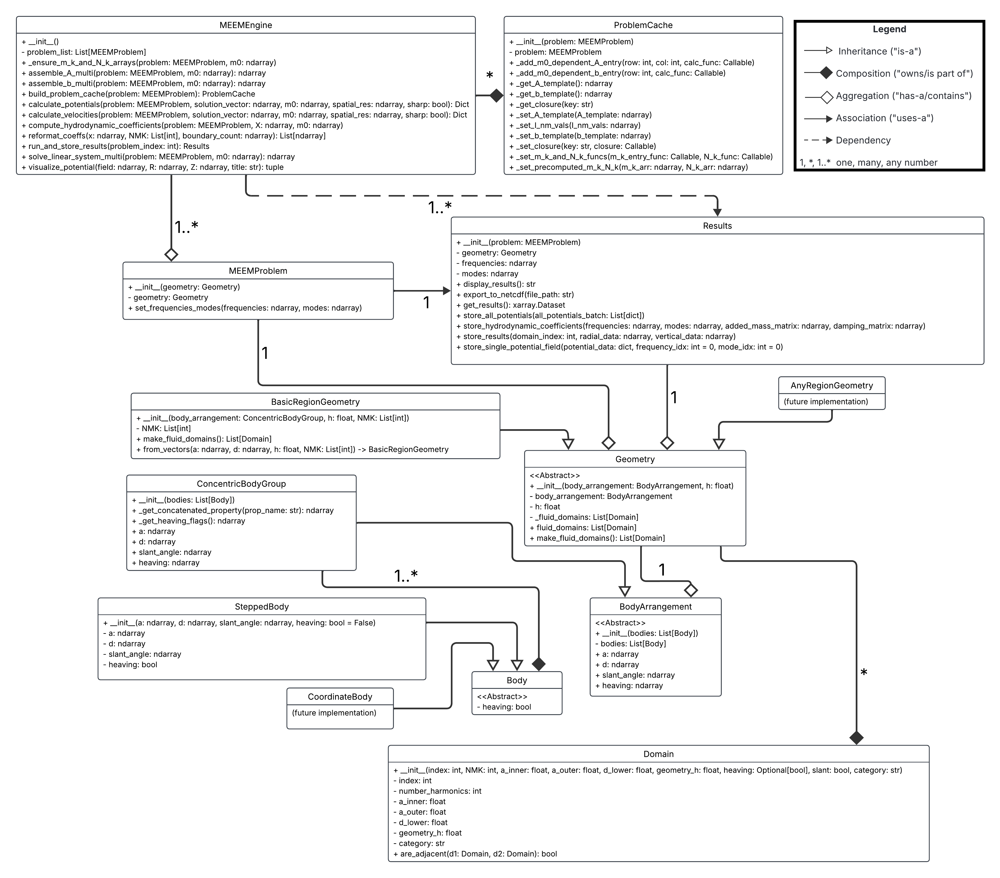
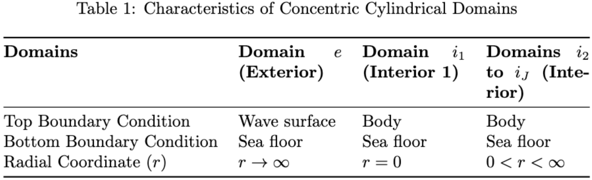
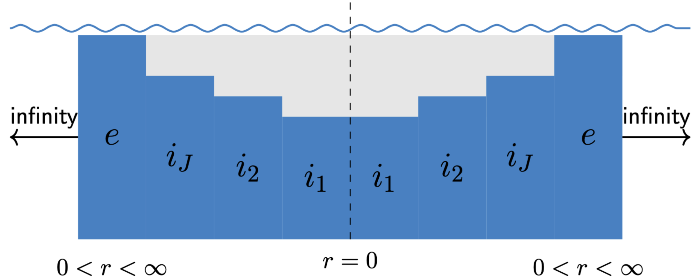
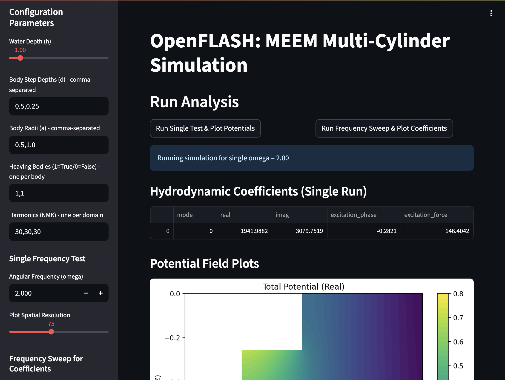
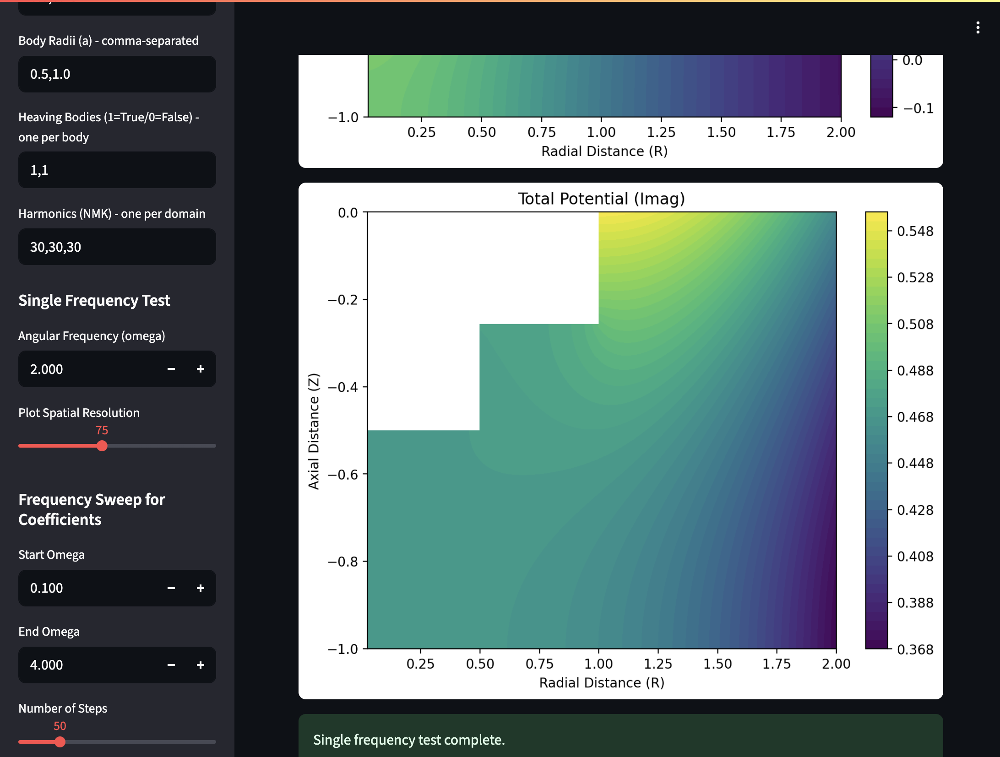
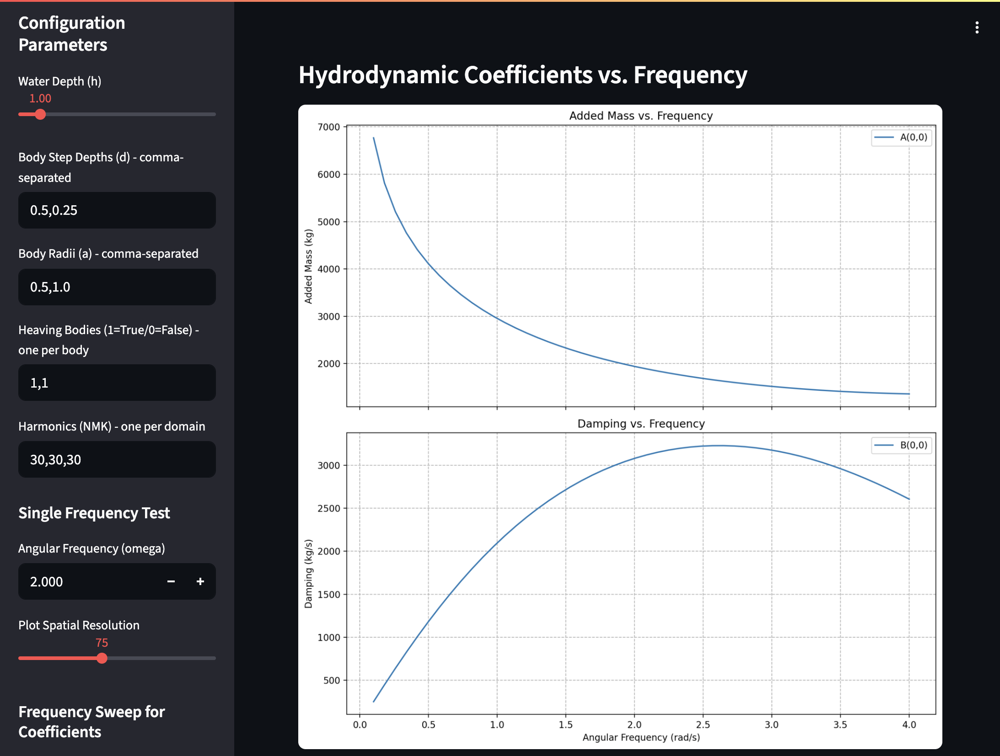
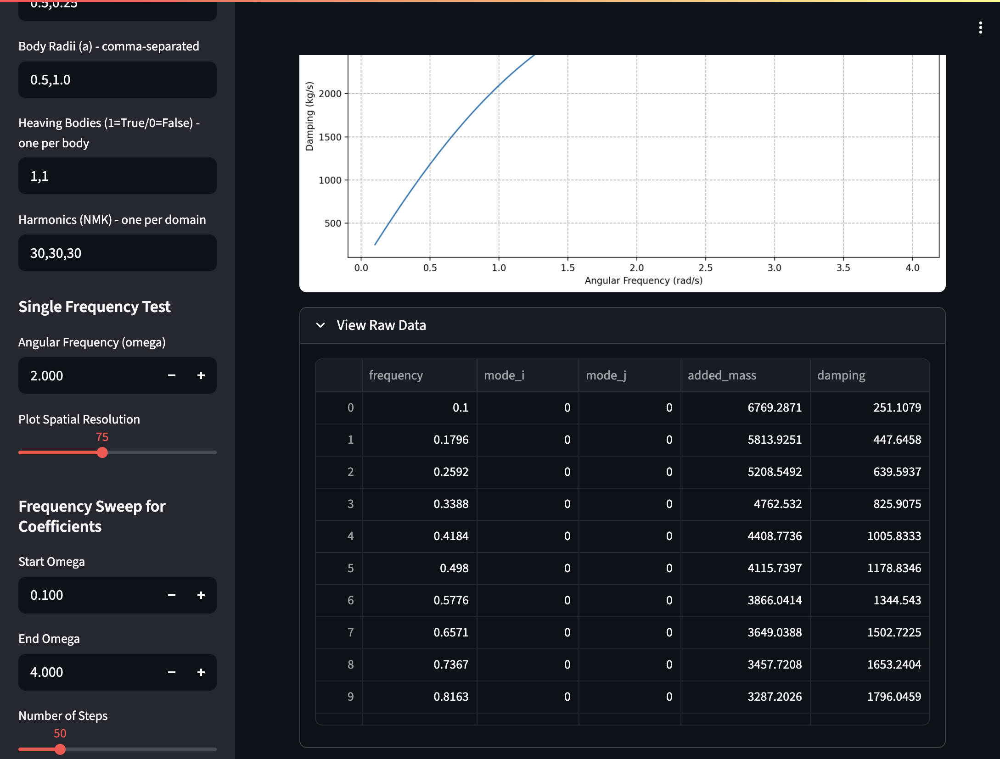

# Summary

`OpenFLASH` is a Python package for solving hydrodynamic boundary value problems using analytical and semi-analytical methods. It implements the Matched Eigenfunction Expansion Method (MEEM) for bodies of multiple concentric cylinders. This method, presented by @mccabe2024open at the UMERC+METS 2024 Conference, can reduce the runtime by two orders of magnitude compared to traditional Boundary Element Method (BEM) solvers, making it more suitable for design optimization studies of floating structures such as wave energy converters (WECs).

# Statement of Need

Wave energy converters (WECs) hold significant promise for transforming wave oscillation into energy, offering predictability and energy security that complement other renewable sources [@bhattacharya2021timing; @fusco2010variability]. However, the optimization of WECs has been hindered by the computational costs of modeling their hydrodynamic interactions in waves. `OpenFLASH` addresses this challenge by providing an open-source, object-oriented Python implementation for modeling hydrodynamic forces using semi-analytical methods.

The package is designed to handle multi-domain problems, including exterior domains extending to infinity and interior domains with specific radial extents. The computational workflow begins by defining the geometry, assembling and solving the linear system, and calculating hydrodynamic coefficients. This specialization bridges the gap between purely analytical derivations and heavy numerical computation, offering a tool that is both modular and extensible for marine engineering research.

# State of the Field

Hydrodynamic modeling typically relies on BEM solvers like WAMIT or `Capytaine` [@Ancellin2019], which require surface meshing and become computationally expensive during wide-frequency sweeps. Alternative tools like `MDOcean` [@MDOcean2026] and `SAHydro` [@SAHydro2015] utilize MEEM but are largely restricted to specific 2- or 3-cylinder configurations within the MATLAB ecosystem. Other specialized tools like `Hulme_Heaving_Sphere` [@choi:tel-02493305] are limited to non-cylindrical classes of devices.

`OpenFLASH` was built as a standalone library because existing BEM-based codes like `Capytaine` use a fundamentally different computational architecture (surface integration vs. domain decomposition). While MATLAB-based scripts exist for MEEM, `OpenFLASH` abstracts this logic into a modular API supporting arbitrary stepped-cylindrical geometries. This fills a critical gap in the Python ecosystem for high-speed, multi-domain concentric body modeling, delivering results over 160 times faster than BEM alternatives for compatible geometries.

# Software Design

`OpenFLASH` balances computational efficiency with user accessibility through a tiered architecture.  \autoref{fig:uml} demonstrates the relationships between classes in the package. Users interact with high-level objects like `SteppedBody` and `ConcentricBodyGroup`, which partition the fluid volume into discrete `Domain` objects (see \autoref{fig:domain_table}). \autoref{fig:domain_drawing} shows a typical problem geometry that is divided into multiple concentric fluid domains, including interior domains under the bodies and a final, semi-infinite exterior domain. 

To minimize Python overhead during solving, the software employs an extraction engine that flattens these complex objects into raw NumPy arrays for high-performance linear algebra.

A key architectural trade-off was made in the `ProblemCache` class. To accelerate wide-frequency sweeps, we increased the memory footprint by precomputing frequency-independent matrix blocks and integration constants. This avoids rebuilding dense linear systems for every frequency step, a significant bottleneck in traditional solvers. Additionally, we opted to utilize `xarray` for data organization. While this adds a dependency, it ensures that `OpenFLASH` outputs are drop-in replacements for `Capytaine` users, facilitating immediate integration into existing research pipelines without requiring custom data parsers.

The package utilizes Sphinx to generate comprehensive documentation. The documentation includes a tutorial that guides users through the package’s processes and explains its capabilities. The sphinx documentation is deployed in the browser through: https://symbiotic-engineering.github.io/OpenFLASH/.

A Streamlit application (docs/app.py) provides a graphical user interface for interacting with OpenFLASH. Users can define problem parameters through the GUI, run simulations, and visualize the resulting pote  ntial fields in real-time. This interactive tool enhances the usability and accessibility of the package. The streamlit app is deployed through: https://symbiotic-engineering.github.io/OpenFLASH/app_streamlit.html.

The package includes a comprehensive suite of unit tests (tests directory) using the pytest framework to ensure the code's reliability and correctness. These tests cover the core functionalities, ensuring the reliability and correctness of the code across different modules.

# Research Impact Statement

`OpenFLASH` provides a high-performance alternative to BEM solvers, optimized for iterative design. Its impact is already evidenced by its integration into `MDOcean` [@MDOcean2026], where its speed allows researchers to evaluate thousands of design iterations that were previously computationally prohibitive. 

Comparative benchmarking against `Capytaine` (available in `package/test/benchmark_openflash_vs_capytaine.py`) demonstrates that `OpenFLASH` achieves 98.19% accuracy in hydrodynamic coefficient calculations while delivering a 162-fold reduction in runtime and requiring 1,000 times less memory. First presented at the UMERC+METS 2024 Conference, `OpenFLASH` represents the first open-source Python implementation of MEEM for multi-domain cylindrical structures. By lowering the barrier to entry for high-fidelity hydrodynamic modeling, it serves as a community-ready tool for advancing offshore renewable energy research.

# AI Usage Disclosure

Generative AI tools, specifically Gemini 3 Pro and GitHub Copilot, were used to assist in drafting the initial structure of the documentation and to refactor parts of the `ProblemCache` logic. All AI-generated code was reviewed, integrated into the `pytest` suite, and verified against numerical baselines derived from previous analytical work. No AI tools were used in the writing of this manuscript.

# Acknowledgements

We acknowledge the foundational work on MEEM as presented in the cited references. The development of OpenFLASH has been supported by the resources and expertise within the SEA Lab, led by Professor Maha N. Haji. We also acknowledge the contributions of the following students to the development of this software: Yinghui Bimali, En Lo, and John Fernandez. We also acknowledge the ongoing collaborations with Jessica Nguyen, Clint Chester Reyes, and Brittany Lydon for integrating the semi-analytical code they developed for other geometries in future OpenFLASH releases. We thank Prof. R. W. Yeung and Seung-Yoon Han for discussions on the theory and computation of this method.

We also gratefully acknowledge support for Kapil Khanal and Collin Treacy from a Sandia National Laboratories seedling grant and Rebecca McCabe from the NSF GRFP. The contributions of undergraduate researchers were supported by Cornell University’s Engineering Learning Initiative (ELI).

This material is based upon work supported by the National Science Foundation Graduate Research Fellowship under Grant No.DGE–2139899. Any opinion, findings, and conclusions or recommendations expressed in this material are those of the authors and do not necessarily reflect the views of the National Science Foundation.

# References
